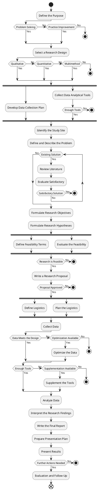

# Applied Research Conduction
Applied research conduction diagram is an activity diagram, which is used as a blueprint of conducting an applied research. The diagram does not limit the freedom of choice and defines more the abstract actions to be performed. Expanding the diagram with additional actions is not prohibited.

---

## Contents
- [Introduction](#applied-research-conduction)
- [Diagram](#diagram)

## Diagram

#diagram