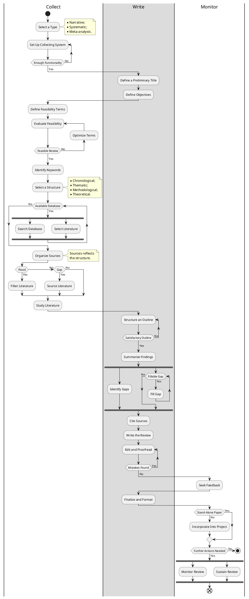

# Literature Review Conduction Diagram
Literature review conduction diagram is an activity diagram, which is used as a blueprint of conducting a literature review. The diagram does not limit the freedom of choice and defines more the abstract actions to be performed. Expanding the diagram with additional actions is not prohibited.

---

## Contents
- [Introduction](#literature-review-conduction-diagram)
- [Diagram](#diagram)

## Diagram

#diagram