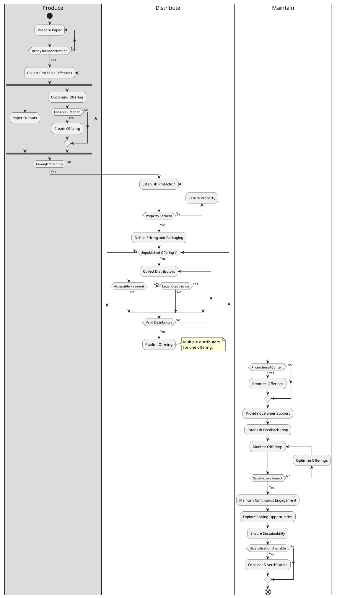

# Paper Monetization Diagram
Paper monetization diagram is an activity diagram, which is used as a blueprint to monetize an academic paper outputs and engaged audience groups. The monetization process aims to convert the resources into sustainable revenue streams.

---

## Contents
- [Introduction](#paper-monetization-diagram)
- [Diagram](#diagram)

## Diagram

#diagram