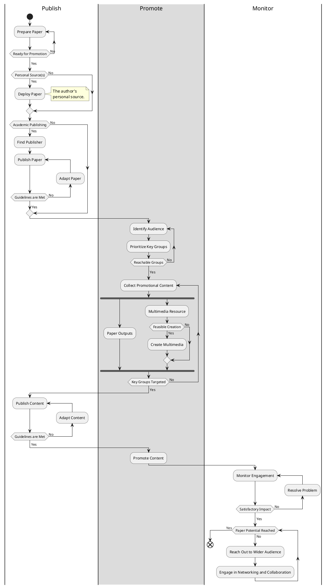

# Paper Promotion Diagram
Paper promotion diagram is an activity diagram, which is used as a blueprint to promote an academic paper in order to increase public awareness of it. This takes into account publishing, audience identification and engagement via creating multimedia resources and progressively reaching out a wider audience.

---

## Contents
- [Introduction](#paper-promotion)
- [Diagram](#diagram)

## Diagram

#diagram