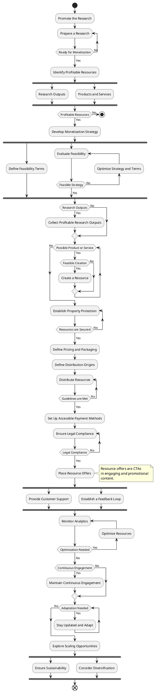

# Research Monetization Diagram
Research monetization diagram is an activity diagram, which is used as a blueprint to monetize a research outputs and engaged audience groups. The monetization process aims to convert the outputs into sustainable revenue streams.

---

## Contents
- [Introduction](#research-monetization-diagram)
- [Diagram](#diagram)

## Diagram

#diagram