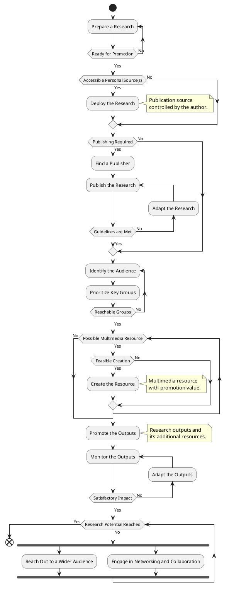

# Research Promotion Diagram
Research promotion diagram is an activity diagram, which is used as a blueprint to promote a research in order to increase public awareness of it. This takes into account research publishing, audience identification and engagement via creating multimedia resources and progressively reaching out a wider audience.

---

## Contents
- [Introduction](#research-promotion)
- [Diagram](#diagram)

## Diagram

#diagram